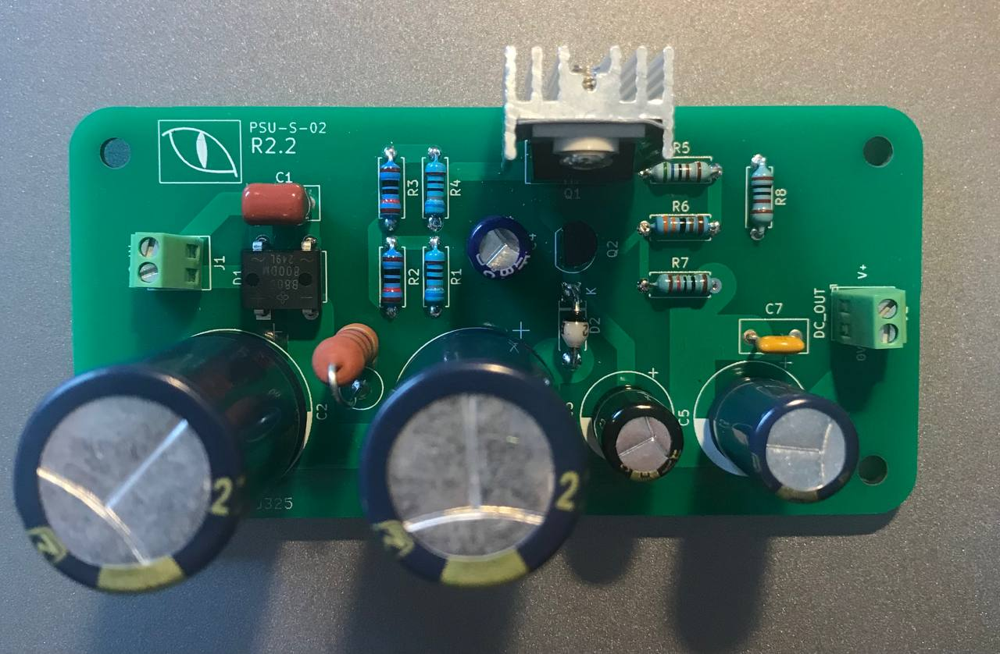

# PreConsonant PSU

### Basic Information

This is a 24V PSU I designed for use with the [PreConsonant phono preamplifier](https://github.com/SpinningVinyl/PreConsonant2021). It is basically a discrete feedback regulator with an error amplifier consisting of a single transistor (Q2 on the circuit diagram). It is designed to be used with a 24V transformer because I wanted to use an off-the-shelf 24V AC wall wart to power my phono preamplifier build. Since transformers typically have no-load output voltage that can be up to 20% higher than their rated voltage under full load, it was going to be too high for a standard 3-pin voltage regulator IC (e.g. LM7824).

### Technical specifications

 - Input voltage: less than 30V AC (with the specified components)
 - Output voltage: approx. 24V DC
 - Load regulation: less than 1% at 100mA output current (component values have been calculated for output currents up to 500mA)
 - Ripple and noise: more than 60dB below the output level
 
### Documentation
The documentation (bill of materials and full circuit diagram) is located in the `docs` folder.

### Status of the project

The project has been built and tested.

### License
See the `LICENSE` file for details.
